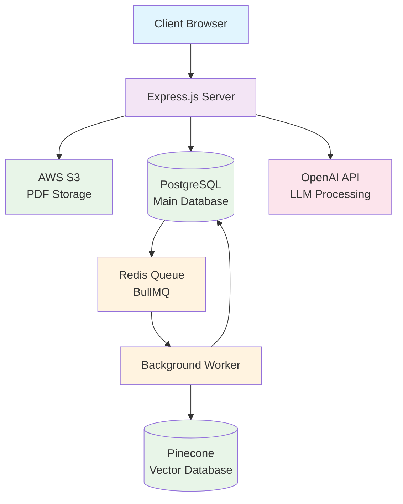

# ArcPrime Technical Assignment


## Demo video


# System Architecture

## Architecture Diagram



## System Components

### Frontend
- **React Application**: User interface for inventors and IC

### Backend
- **Express.js Server**: REST API with controllers and services
- **PostgreSQL**: Main database with outbox pattern
- **Redis + BullMQ**: Message queue for background processing
- **Background Worker**: Processes outbox events

### Storage
- **AWS S3**: PDF file storage with signed URLs
- **Pinecone**: Vector database for semantic search

### External Services
- **OpenAI API**: LLM processing for text extraction

## How to run the project

### Prerequisites

- Node.js (LTS)
- Docker & Docker Compose
- PostgreSQL (via Docker Compose)
- AWS S3 credentials (or compatible S3 service)
- OpenAI API key

### Steps

#### 1. Create environment file

- Copy `.env.example` → `.env`
- Fill in AWS credentials and OpenAI key

#### 2. Start services

```bash
docker compose up
```

#### 3. Backend

```bash
cd backend
npm run deploy:s3
npm run dev
```

#### 4. Frontend

```bash
cd frontend
npm run dev
```

## Key technical decisions & trade-offs

### Architecture (pragmatic clean architecture)

The backend is inspired by Clean Architecture to minimize coupling between core logic and infrastructure.

Full IoC/DI wasn't implemented due to time constraints; modules are kept simple and replaceable.

### Docket number generation (race-safe)

Uses PostgreSQL `GENERATED AS IDENTITY` to ensure monotonic, race-free incrementing when creating new disclosures.

Avoids manual "read-then-increment" patterns that require locks or degrade performance.

### Dual-write consistency (DB + vector store)

Creating a disclosure also requires writing an embedding to a vector database.

To prevent inconsistency (one write succeeds, the other fails), an Outbox + Queue pattern is used:

- Persist the disclosure and an outbox event in the same DB transaction.
- A worker reads the outbox and performs the vector-DB write with retries/idempotency.

### File uploads (scalable)

Uses S3 Signed URLs for direct browser → object storage uploads.

Keeps the backend from becoming a bottleneck under high load; reduces server bandwidth and memory pressure.

### Data model extensions (targeted)

Added a few fields to store important information for Inventors and IC


## Assumptions

- PDFs are ≤ 50 MB and ≤ 200 pages.

## Production readiness (what's next)

### Architecture

Move to full Clean Architecture with IoC/DI to simplify substitution of services (LLMs, storage, queues).

### Security

Add authentication & authorization

### Scale

Consider replacing BullMQ with Kafka (or equivalent) for higher throughput, stronger ordering/retention guarantees, and richer retry semantics.

Optimize frontend performance by reducing unnecessary re-renders and minimizing redundant API calls.

### Reliability & Ops

Define standardized error codes and error envelopes.

Add observability: structured logging, metrics (latency/error rates), tracing.

Health checks, alerting, and dashboards for extraction/queue throughput.


